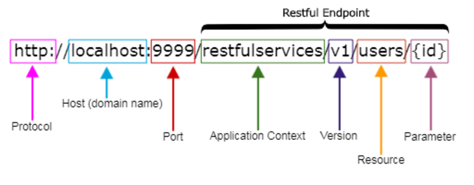

# API Rest

REST (Representational State Transfer) est un style architectural pour concevoir des services web.

Il est basé sur des principes simples et utilise le protocole HTTP pour permettre aux systèmes informatiques de communiquer entre eux.

REST est très populaire dans le développement d'API (Interfaces de Programmation d'Applications), notamment pour les applications web et mobiles.

## Les principes fondamentaux de REST :

### 1. **Stateless (Sans état) :**

Chaque requête d'un client au serveur doit contenir toutes les informations nécessaires pour traiter cette requête. Le serveur ne garde pas de trace des précédentes requêtes, c'est-à-dire qu'il ne stocke pas d'état de la session entre les appels. Cela permet de rendre l'API plus simple et plus scalable.

### 2. **Client-Serveur :**

L'architecture REST repose sur une séparation claire entre le client et le serveur. Le client envoie des requêtes au serveur, qui les traite et renvoie une réponse. Cette séparation permet d'améliorer la flexibilité et l'évolutivité de l'application.

### 3. **Cacheable (Cacheable) :**

Les réponses du serveur peuvent être marquées comme cacheables ou non. Cela permet au client de stocker temporairement des réponses pour ne pas avoir à refaire la même requête à chaque fois, ce qui améliore la performance.

### 4. **Uniform Interface (Interface uniforme) :**

REST impose une interface uniforme, ce qui signifie que l'ensemble des ressources (données ou objets) est accessible via un ensemble de règles standardisées. Par exemple, les mêmes verbes HTTP (GET, POST, PUT, DELETE) sont utilisés de manière cohérente pour interagir avec les ressources.

### 5. **Layered System (Système en couches) :**

Un client ne sait pas forcément s'il communique directement avec le serveur principal ou avec un serveur intermédiaire. Cela permet de créer des architectures plus complexes et évolutives (par exemple, l'utilisation de proxies, de serveurs de cache, etc.).

### 6. **Code on Demand (optionnel) :**

Le serveur peut éventuellement envoyer du code exécutable au client, comme des applets JavaScript. Cela n'est pas une nécessité pour les API REST, mais c'est une fonctionnalité optionnelle.

## Comment fonctionne REST ?

REST fonctionne en exploitant les verbes HTTP standards pour réaliser des opérations sur les ressources. Ces ressources sont généralement des objets ou des données identifiées par une URL. Voici comment ça se passe :

### 1. Requêtes HTTP :

- REST utilise les méthodes HTTP pour définir des actions à réaliser sur des ressources. Les quatre verbes principaux sont :
    - GET : Pour récupérer des données d'une ressource (lecture).
    - POST : Pour envoyer des données au serveur (création).
    - PUT : Pour mettre à jour des données sur une ressource existante (mise à jour complète).
    - DELETE : Pour supprimer une ressource.
    - PATCH (optionnel) : Pour appliquer des modifications partielles à une ressource.

### 2. Ressources :

- Une ressource est une entité (donnée ou objet) accessible via une URL.

### 3. Requêtes et Réponses :

- Le client envoie une requête HTTP vers l'URL d'une ressource avec le bon verbe (GET, POST, PUT, DELETE). Le serveur traite la requête et renvoie une réponse, généralement au format JSON ou XML.

### 4. Statut des réponses HTTP :

- Le serveur répond avec un code de statut HTTP pour indiquer si la requête a réussi ou échoué, par exemple :
    - 200 OK : La requête a réussi.
    - 201 Created : La ressource a été créée.
    - 400 Bad Request : La requête est mal formulée.
    - 404 Not Found : La ressource demandée n'existe pas.
    - 500 Internal Server Error : Il y a eu une erreur sur le serveur.

## Structure d'URI à respecter

## Sources 

- [L'architecture REST expliquée en 5 règles](https://www.nicolashachet.com/blog/developpement-php/larchitecture-rest-expliquee-en-5-regles/)